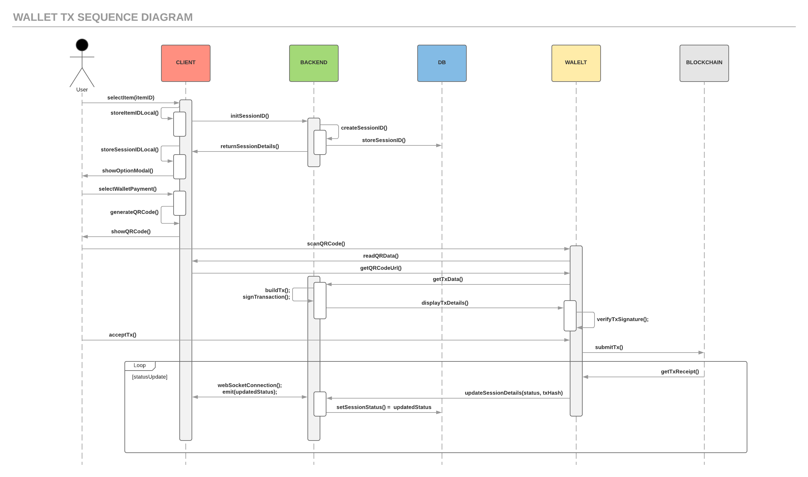

# Proof of Concept for PumaPay

# Description
This is a Proof of Concept for Pumapay Payment Protocol V1. 
The V1 of the protocol is a push payment implementation of an ERC20 token in the Ethereum network. 

## Pumapay Payment Sequence Diagram


### Details:
  The transacation process begins when the user selects a specific item. As soon as an item is selected its unique id is stored in the local storage under the name “itemID”. In addition to that, a call is made to the backend to initiate a session. This created a unique Session id that is stored both locally(“SessionID”) and on the database. As soon as the user clicks on the “Buy with one click” a popup appears that gives the user two options for completing the transaction. In this case we will cover the case that the user picks to pay using the PumaPay wallet app. When the user selects the wallet a function is called that will generate a QRCode which will be used to create the QR that need to be scanned in order to complete the transaction using the wallet. The QR code is displayed to the user who then has to scan the QR using the mobile application. The app reads the data from the QR and using the url impeded in the QR it makes a call to the backend to get the TxData. When the call is made to the backend the transaction is build and the signature of the transaction is signed. The signature and TxData are then send back to the wallet. The tx details are displayed to the user and the wallet used the signature to verify the transaction is correct. As soon as the user accepts the transaction the transaction request is submitted to the blockchain. When submitted the Blockchain returns back the txReceipt. The wallet then makes a call to the backend with the status and txHash and the status of the transaction is updated both on the Database as well as the client interface. This process is then repeated until the transaction is completed.

Find the PDF [here](diagrams/UML_Diagram.pdf)

# Installation

## Prerequisites

* [Install Node and NPM](https://www.npmjs.com/get-npm)
* [Install Docker](https://docs.docker.com/engine/installation/)
* [Angular-cli](https://github.com/angular/angular-cli) `npm install -g @angular/cli@latest`
* For Windows in case it will not execute `npm install` correctly > `npm install -g windows-build-tools`

## Get started

1.  Clone this repo

```git
$ git clone https://github.com/pumapayio/puma-poc.git
```

2.  Change to project directory

```sh
$ cd puma.poc
```

3.  Install the required packages

```npm
$ npm install
```

or individually server and client

```npm
$ npm install-server
$ npm install-client
```

4.  Build the docker containers

```docker
$ docker-compose build
```

5.  Start the application

```docker
$ docker-compose up -d
```

## PoC local development ports

* PoC Webpage : `http://localhost:4200`
* Server: `http://localhost:8080`
* DB:
  * PGHOST=postgres
  * PGUSER=local_user
  * PGPASSWORD=local_pass
  * PGDATABASE=local_puma_poc
  * PGPORT=`http://localhost:5432`

#### Clean up local development environment

```bash
$ docker-compose down
## OR
$ docker ps # list running containers
$ docker ps -a # list all containers
# check the COINTAINER_ID from list obtained in previous command
$ docker rm <CONTAINER_ID> # remove the container with ID
$ docker rm <CONTAINER_ID> -f # force remove the container with ID
```

# Tests

First you need to deploy the application locally - See [Local Deployment](#local-deployment)
Testing Suite:

* [Mocha](https://mochajs.org/) - Test Framework
* [Chai](http://www.chaijs.com/) - Assertion Library
* [Supertest](https://github.com/visionmedia/supertest) - HTTP Testing

## Run all tests

To run all the tests

```bash
$ npm test
```

## E2E Testing

To run the E2E tests

```bash
$ npm run test-e2e
```

## Unit Testing

To run all the Unit tests

```bash
$ npm run test-unit
```

To run individual unit test

```bash
$ mocha -r ts-node/register path/to/unit/test
```

# API Documentation

To see the specification of the APIs import [swagger.yml](./swagger.yml) at the [online swagger editor](https://editor.swagger.io)

# Configure Docker

You need to share your C drive with docker. Go to `Docker > Settings > Shared Drives > Select C > Apply` - You will be asked to fill in your credentials.
In case this doesn't work, follow [this guide](https://blogs.msdn.microsoft.com/stevelasker/2016/06/14/configuring-docker-for-windows-volumes/).


# Troubleshooting

### Docker containers failed to start

In case of the error below when starting the docker containers, you should quit docker from the taskbar and start it again

```
ERROR: for pumaapi_pp_io_dev_1  Cannot start service pp_io_dev: driver failed programming external connectivity on endpoint pumaapi_pp_io_dev_1
```

### Docker Shared Volumes - Not working as expected

In case of the error below when starting the docker containers, you should go to Docker Settings from the taskbar > Shared Drives > UnShare and Share the C drive for this to work. Keep in mind that your firewall should be disabled during this process.

```
 psql:/docker-entrypoint-initdb.d/20-create-io-tables.sql:0: could not read from input file: Is a directory
```

# Docker Useful Links

You can find some more info about docker [here](https://github.com/wsargent/docker-cheat-sheet) and [here](https://medium.com/statuscode/dockercheatsheet-9730ce03630d)

#### Other Useful docker commands

* Build Docker images

```docker
# for all containers
docker-compose build
# or for a specific container
docker-compose build <CONTAINER_NAME>
```

* Start Docker containers

```docker
# for all containers
docker-compose up -d  
# or for a specific container
docker-compose up -d <CONTAINER_NAME>
```

* See Docker containers

```docker
# only running containers
docker ps
# all containers
docker ps -a
```

* Remove Docker containers

```docker
# specific container
docker rm <CONTAINER_ID>
# all containers
docker rm $(docker ps -a -q)
# add -f at the end to force container removal
```

* See Docker images

```docker
docker images
```

* Remove Docker images

```docker
# specific image
docker rmi <IMAGE_ID>
# all unused images
docker images prune
```

* See Docker container logs

```docker
# for all containers
docker-compose logs -f
# or for a specific container
docker-compose logs -f <CONTAINER_NAME>
```
